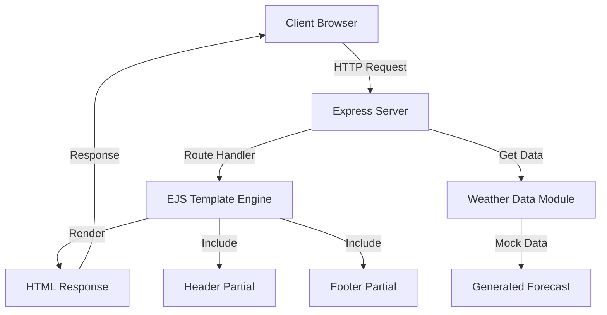

# Architecture Overview

## Application Structure



## Request Flow

1. **Client Request** - User navigates to a page (e.g., `/today?city=London`)
2. **Route Matching** - Express routes the request to appropriate handler
3. **Data Fetching** - Server fetches weather data from mock generator
4. **Template Rendering** - EJS compiles template with data
5. **Response** - HTML sent back to client browser

## File Structure

```
Weather App
│
├── Server Layer (Node.js/Express)
│   └── server.js - Routes & middleware
│
├── Data Layer
│   └── data/weatherData.js - Mock weather generator
│
├── View Layer (EJS Templates)
│   ├── partials/ - Reusable components
│   │   ├── header.ejs
│   │   └── footer.ejs
│   └── pages/
│       ├── index.ejs
│       ├── now.ejs
│       ├── today.ejs
│       └── ... (other forecast pages)
│
└── Static Assets
    ├── css/style.css
    ├── js/app.js
    └── images/weather-icons/
```

## Key Components

### Server (server.js)
- Express application setup
- Route definitions for all pages
- EJS configuration
- Static file serving

### Weather Data Module (data/weatherData.js)
- Mock data generation functions
- Weather condition definitions
- Forecast calculation logic

### Templates (views/*.ejs)
- Dynamic HTML generation
- Data interpolation
- Partial includes for DRY code

### Styling (public/css/style.css)
- Gismeteo-inspired design
- Responsive layout
- Professional weather UI components
